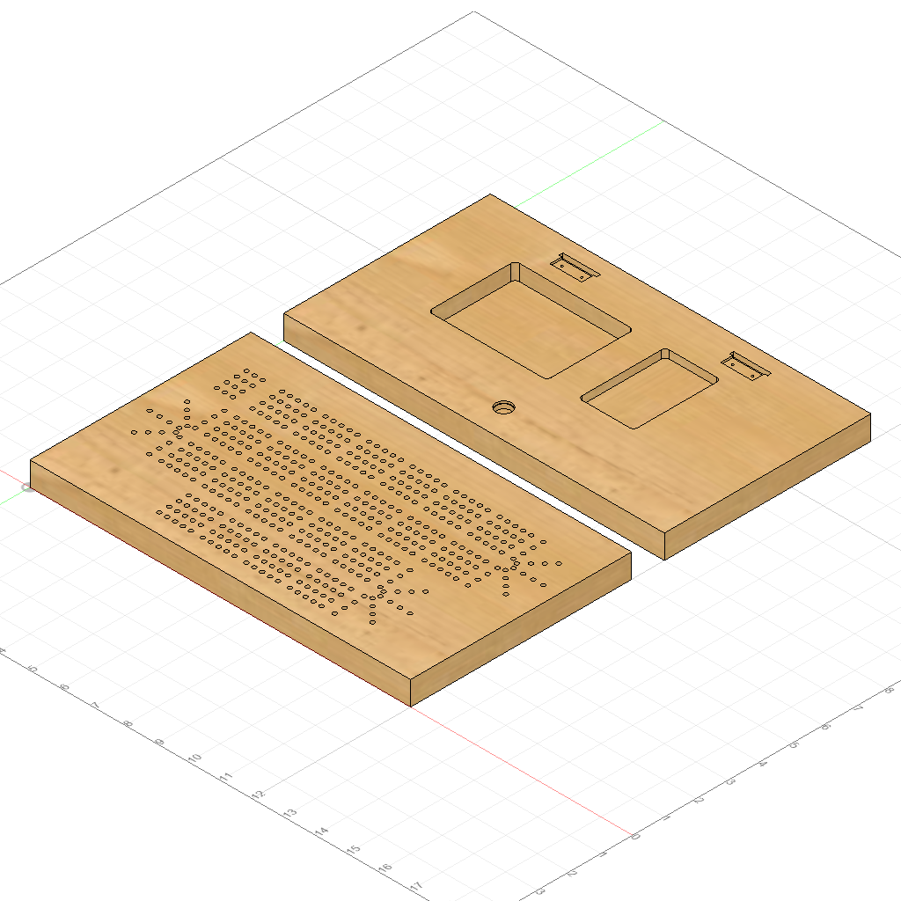

# Cribbage Board
CAD and CAM for a four player, 120 peg cribbage board.

<video width="320" height="240" controls>
  <source type="video/mp4" src="./images/cam_video.mp4">
</video>

## Hardware
- Magnet Fasteners
  - [Master Magnet 0.47 in. Neodymium Rare-Earth Magnet Discs (6 per Pack)](https://www.homedepot.com/p/Master-Magnet-0-47-in-Neodymium-Rare-Earth-Magnet-Discs-6-per-Pack-07046HD/202526367)
    - Maximum pull: 4 lbs.
    - Actual diameter: 15/32"
    - I would suggest a slightly stronger magnet!
- Hinges
  - [Everbilt 1 in. Satin Brass Narrow Utility Non-Removable Pin Hinges (2-Pack)](https://www.homedepot.com/p/Everbilt-1-in-Satin-Brass-Narrow-Utility-Non-Removable-Pin-Hinges-2-Pack-14469/203339945)
  - Dimensions can be found [here](./images/hinge_dimensions.png) and [here](./images/hinge_dimensions_2.png).

## Finish
- Zinsser Bulls Eye SealCoat 100% Wax-Free Shellac
